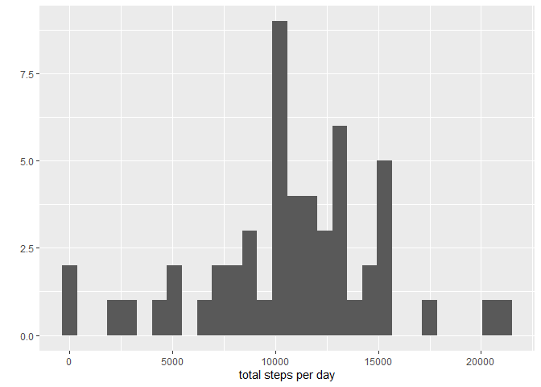
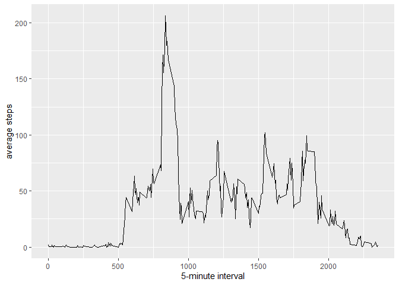
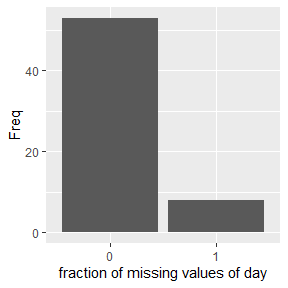
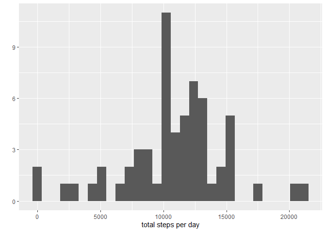
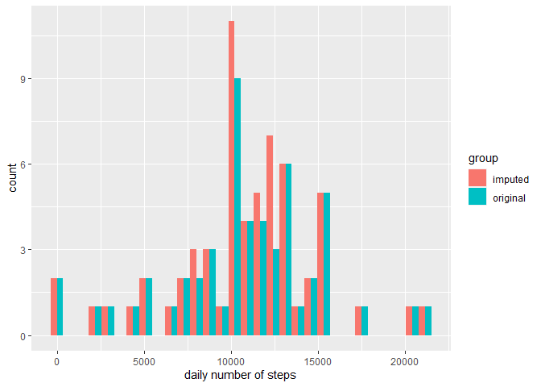
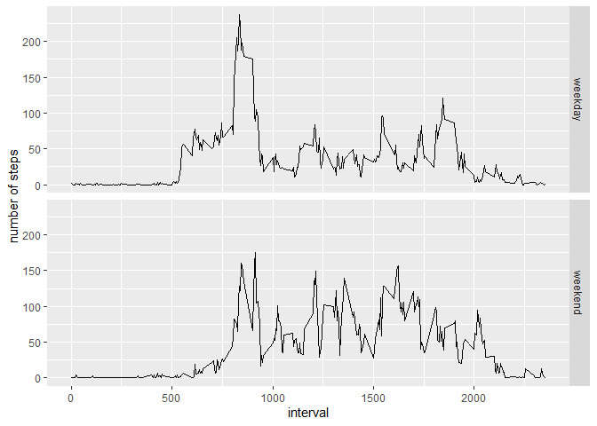

Following packages are used for the analysis:

```r
library(dplyr)
library(ggplot2)
```

## Loading and preprocessing the data

If necessary unzip raw data and read in activity.csv. The tibble class is used.


```r
if (!file.exists("activity.csv")) unzip("activity.zip")
act <- as_tibble(read.csv("activity.csv"))
str(act)
```

```
## tibble [17,568 x 3] (S3: tbl_df/tbl/data.frame)
##  $ steps   : int [1:17568] NA NA NA NA NA NA NA NA NA NA ...
##  $ date    : chr [1:17568] "2012-10-01" "2012-10-01" "2012-10-01" "2012-10-01" ...
##  $ interval: int [1:17568] 0 5 10 15 20 25 30 35 40 45 ...
```

Formatting date-column:

```r
act$date <- as.Date(act$date)
head(act)
```

```
## # A tibble: 6 x 3
##   steps date       interval
##   <int> <date>        <int>
## 1    NA 2012-10-01        0
## 2    NA 2012-10-01        5
## 3    NA 2012-10-01       10
## 4    NA 2012-10-01       15
## 5    NA 2012-10-01       20
## 6    NA 2012-10-01       25
```


## What is mean total number of steps taken per day?

Using date as group for summarizing the total number of steps per day.

```r
act.sum <- act %>% group_by(date) %>% summarize(total.steps = sum(steps))
head(act.sum)
```

```
## # A tibble: 6 x 2
##   date       total.steps
##   <date>           <int>
## 1 2012-10-01          NA
## 2 2012-10-02         126
## 3 2012-10-03       11352
## 4 2012-10-04       12116
## 5 2012-10-05       13294
## 6 2012-10-06       15420
```

The total number of steps per day are distributed as follows. Days with missing values are excluded from the plot.

```r
qplot(act.sum$total.steps[!is.na(act.sum$total.steps)], bins = 30, xlab = "total steps per day")
```



```r
total.steps <- c(mean(act.sum$total.steps, na.rm = T), median(act.sum$total.steps, na.rm = T))

summary(act.sum$total.steps)
```

```
##    Min. 1st Qu.  Median    Mean 3rd Qu.    Max.    NA's 
##      41    8841   10765   10766   13294   21194       8
```
The mean total steps per day were found to be 10766.19 while the median is 10765.

## What is the average daily activity pattern?

To analyze the average activity pattern in the course of the day, the step count is averaged per interval for all days whereby missing values are excluded.

```r
act.daily.trend <- act %>% group_by(interval) %>% summarize(mean.steps = mean(steps, na.rm = T))
summary(act.daily.trend$interval)
```

```
##    Min. 1st Qu.  Median    Mean 3rd Qu.    Max. 
##     0.0   588.8  1177.5  1177.5  1766.2  2355.0
```

```r
qplot(x = act.daily.trend$interval, y = act.daily.trend$mean.steps, geom = "line", 
      xlab = "5-minute interval", ylab = "average steps")
```



Finding the 5-minute interval which contains the maxmimum steps on average:

```r
maxsteps <- act.daily.trend[which.max(act.daily.trend$mean.steps), c("interval", "mean.steps")]
maxsteps
```

```
## # A tibble: 1 x 2
##   interval mean.steps
##      <int>      <dbl>
## 1      835       206.
```
The 5-minute interval 835 contains with 206.2 on average the maximum number of steps during the course of the day.

## Imputing missing values

### Investigating missing values

```r
total.na <- sum(is.na(act$steps))
ratio.na <- mean(is.na(act$steps))
cbind(total.na, ratio.na)
```

```
##      total.na  ratio.na
## [1,]     2304 0.1311475
```

```r
daily.na <- act %>% group_by(date) %>% summarize(ratio.na = mean(is.na(steps)))
daily.na
```

```
## # A tibble: 61 x 2
##    date       ratio.na
##    <date>        <dbl>
##  1 2012-10-01        1
##  2 2012-10-02        0
##  3 2012-10-03        0
##  4 2012-10-04        0
##  5 2012-10-05        0
##  6 2012-10-06        0
##  7 2012-10-07        0
##  8 2012-10-08        1
##  9 2012-10-09        0
## 10 2012-10-10        0
## # ... with 51 more rows
```

```r
table(daily.na$ratio.na)
```

```
## 
##  0  1 
## 53  8
```

```r
ggplot(as.data.frame(table(daily.na$ratio.na)), aes(x=Var1, y = Freq)) + 
    geom_bar(stat="identity") + labs(x =  "fraction of missing values of day")
```



There are in total 2304 missing values in the data set which is equal to 13.1 % of all cases. The barplot indicates that missing values occur always for the complete day. Hence, if for a given day there are missing values, this means that all values of that day are missing. The occurance of missing values is not completely random. To impute the missing values of a day with only missing values (as stated before, this is the only case of missing values in this dataset), the average step number for each 5-minute interval is used calculated for the corresponding weekday. For example if data for a monday is missing, only data from mondays is used. This is reasonable to avoid introducing a bias regarding activity patterns during the whole week.

Identifying days with only missing values (meaning a ratio of 1):

```r
days.na <- daily.na[daily.na$ratio.na == 1, 1][[1]]
```

### Imputing values using described method

```r
act.imputed <- act %>% mutate(weekday = weekdays(act$date))
weekday.mean.steps <- act.imputed %>% filter(!(date %in% days.na)) %>% 
    group_by(weekday, interval) %>% summarize(mean.step.number = mean(steps))
weekday.mean.steps
```

```
## # A tibble: 2,016 x 3
## # Groups:   weekday [7]
##    weekday interval mean.step.number
##    <chr>      <int>            <dbl>
##  1 Friday         0                0
##  2 Friday         5                0
##  3 Friday        10                0
##  4 Friday        15                0
##  5 Friday        20                0
##  6 Friday        25                0
##  7 Friday        30                0
##  8 Friday        35                0
##  9 Friday        40                0
## 10 Friday        45                0
## # ... with 2,006 more rows
```

```r
act.imputed <- act.imputed %>% inner_join(weekday.mean.steps, by=c("weekday", "interval")) %>% 
    mutate(steps = ifelse(is.na(steps), mean.step.number, steps)) %>% select(steps, date, interval, weekday)

summary(act.imputed$steps)
```

```
##    Min. 1st Qu.  Median    Mean 3rd Qu.    Max. 
##    0.00    0.00    0.00   37.57   19.04  806.00
```

```r
act.sum.imp <- act.imputed %>% group_by(date) %>% summarize(total.steps = sum(steps))
total.steps.imp <- c(mean(act.sum.imp$total.steps), median(act.sum.imp$total.steps))
summary(act.sum.imp$total.steps)
```

```
##    Min. 1st Qu.  Median    Mean 3rd Qu.    Max. 
##      41    8918   11015   10821   12811   21194
```

```r
qplot(act.sum.imp$total.steps, bins = 30, xlab = "total steps per day")
```



The mean total steps per day were found to be 10821.21 while the median is 11015. For comparison, the original values with missing values were 10766.19 for the mean and 10765 for the median, respectively. The discrepancy is caused by the chosen method for imputing values as the mean values for each weekday were used rather than the total mean values. 

Investigating the impact of imputing missing data on the estimates of the total daily number of steps:

```r
act.sum.imp <- act.sum.imp %>% mutate(group = "imputed")
act.sum     <- act.sum %>% mutate(group = "original") %>% filter(!is.na(total.steps))
comp.sum    <- rbind(act.sum, act.sum.imp)

ggplot(data = comp.sum, mapping = aes(x = total.steps, fill = group)) + geom_histogram(position = "dodge") + labs(x = "daily number of steps")
```

```
## `stat_bin()` using `bins = 30`. Pick better value with `binwidth`.
```




## Are there differences in activity patterns between weekdays and weekends?

Using the dataset with imputed values:

```r
act.pattern.imputed <- act.imputed %>%
  mutate(weekpart = as.factor(ifelse(weekday %in% c("Saturday", "Sunday"), "weekend", "weekday"))) %>%
  group_by(weekpart, interval) %>%
  summarize(mean.steps = mean(steps))

ggplot(act.pattern.imputed, mapping = aes(x = interval, y = mean.steps)) +
  geom_line() + 
  facet_grid(rows = 2, facets = act.pattern.imputed$weekpart) + 
  labs(x = "interval", y = "number of steps")
```


